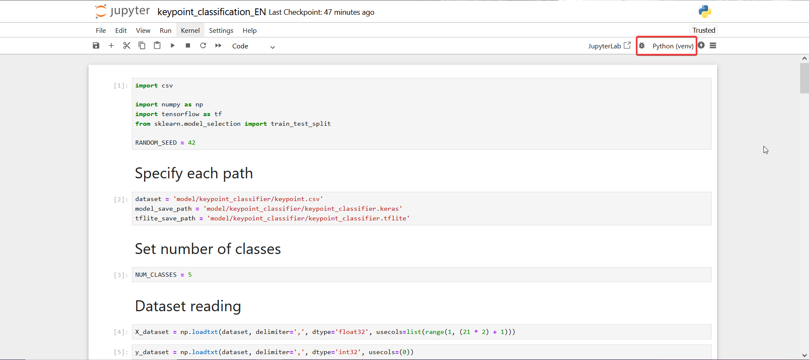

mise en place :

se mettre dans le bon fichier :<br>
```cd .\BACK\```

initialisé son environnement : <br>
```python -m venv venv```

se placer dans l'environnement : <br>
```venv\Scripts\activate```

installation :<br>
```pip install mediapip``` <br>
```pip install opencv-python```<br>
```pip install tensorflow``` <br>
```pip install tf-nightly``` <br>
```pip install scikit-learn``` <br>
```pip install matplotlib``` <br>

installation de Flask :<br>
```pip install flask``` <br>
```pip install flask-cors```<br>

lancer le projet : <br>
```python app.py``` 

# Comment ajouter un signe  

**Attention** : toutes les commandes doivent être exécutées dans votre environnement virtuel (venv).  

## Lancer le projet  
Exécutez la commande suivante :  
```bash
python app.py
```  

Une fois la fenêtre de l'application ouverte, appuyez sur `k`. Cela activera le mode **logging keypoint**, qui permet d'enregistrer les points de la main.  

## Enregistrer les coordonnées spatiales des points de la main  
Utilisez le pavé numérique pour enregistrer un point. Si vous n'avez pas de pavé numérique, les touches numériques en haut du clavier devraient fonctionner, mais il faudra peut-être maintenir `Maj` enfoncé.  

- Choisissez un emplacement libre pour l'enregistrement.  
- Par exemple, pour enregistrer un point sur le **slot 8**, appuyez sur la touche `8`.  
- Une notification temporaire s'affichera en haut à gauche du type :  
  ```
  Num[8]
  ```
- (Si vous souhaitez enregistrer un numéro à plusieurs chiffres, voir plus bas.)  

## Vérifier l'enregistrement  
Pour confirmer que l'enregistrement a bien fonctionné :  
- Ouvrez le fichier **keypoint.csv**.  
- Vous devriez voir de nouvelles lignes commençant par le chiffre sur lequel vous avez appuyé.  

**Conseil** : Pour obtenir un modèle performant, il est recommandé d'enregistrer au moins **500 entrées** avec différentes **orientations** et **angles** de la main (droite et gauche). N'hésitez pas à **spammer** la touche pour enrichir l'apprentissage !  

## Enregistrer un nombre à plusieurs chiffres  
Si vous souhaitez enregistrer un nombre à plusieurs chiffres :  
1. Enregistrez votre position de main avec la touche correspondant à la **dizaine**.  
2. Ouvrez le fichier **keypoint.csv** et ajoutez manuellement l'unité souhaitée à la dizaine associée.  

💡 **Astuce** : Vous pouvez sélectionner toutes les lignes avec `Shift + Alt` et un clic gauche maintenu pour modifier plusieurs entrées en même temps.  

## Attribuer un nom au signe enregistré  
Pour nommer le signe enregistré :  
1. Ouvrez le fichier **keypoint_classifier_label.csv**.  
2. Ajoutez un nom à la position correspondant au numéro enregistré.  
   - **Exemple** : si votre signe est enregistré avec `8`, son nom sera à la **9ᵉ position**.  
   - (Dans `keypoint.csv`, les positions commencent à `0`, tandis que dans `keypoint_classifier_label.csv`, elles commencent à `1`, d'où cette différence.)  

---

# Installation (à faire une seule fois)  

## Installer Jupyter (optionnel, mais recommandé)  
```bash
pip install notebook
```  
Jupyter ne détecte pas automatiquement les bibliothèques installées dans le venv. Il faut donc créer un noyau spécifique.  

## Installer `ipykernel`  
```bash
pip install ipykernel
```  

## Ajouter l'environnement venv à Jupyter  
```bash
python -m ipykernel install --user --name=venv --display-name "Python (venv)"
```  

## Installer les dépendances nécessaires  
```bash
pip install pandas seaborn matplotlib scikit-learn
```  

---

# Utiliser Jupyter  
Lancez Jupyter avec :  
```bash
jupyter notebook
```  
Cela ouvrira une fenêtre dans votre navigateur.  

- Dans Jupyter, ouvrez le fichier **keypoint_classification_EN.ipynb** (c'est le script d'entraînement du bot).  
- Vérifiez que vous utilisez le bon noyau :  

    

- Cliquez sur l'endroit indiqué et choisissez le noyau **Python (venv)**.
- Dans le block **et number of classes** mettre le nombre de signe actuellement créer.
- Exécutez le script en allant dans le menu **Run** et en cliquant sur **Run All Cells**.  

Attendez que toutes les opérations se terminent. Cela peut prendre quelques minutes.  

💡 **Indicateurs** :  
- Devant chaque bloc de code, un `[ * ]` signifie qu'il est en cours d'exécution.  
- Une fois terminé, `*` est remplacé par un numéro.  
- Si une erreur survient, elle sera affichée sous le bloc concerné. 